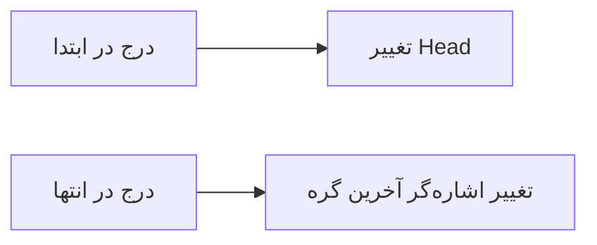

```markdown
# 📚 درسنامه جامع لیست‌های پیوندی

## فصل اول: شناخت لیست‌های پیوندی

### ۱.۱ لیست پیوندی چیست؟

لیست پیوندی یک **ساختار داده‌ای خطی** است که از مجموعه‌ای از **گره‌ها (Nodes)** تشکیل شده است. هر گره شامل دو بخش اصلی می‌باشد:

- **داده (Data)**: اطلاعاتی که گره نگهداری می‌کند
- **اشاره‌گر (Pointer)**: آدرس گره بعدی در حافظه

> 📖 **تشبیه آموزشی**:
> لیست پیوندی مانند یک قطار است که هر واگن می‌داند واگن بعدی کجاست، اما لازم نیست همه واگن‌ها پشت سر هم قرار گرفته باشند.

### ۱.۲ ساختار پایه یک گره

```
┌─────────────┬─────────────┐
│    داده     │   اشاره‌گر   │
│   (Value)   │   (Next)    │
└─────────────┴─────────────┘
         ↓
      یک گره
```

### ۱.۳ نحوه ذخیره‌سازی در حافظه

```
آدرس حافظه:   ۱۰۰۱          ۱۰۲۰          ۱۱۹۰
گره‌ها:     [۱۰|۱۰۲۰] → [۲۰|۱۱۹۰] → [۳۰|NULL]
```

## فصل دوم: انواع لیست‌های پیوندی

### ۲.۱ لیست پیوندی یک‌طرفه (Singly Linked List)

```
سر (Head)
  ↓
┌──────┴──────┐    ┌──────┴──────┐    ┌──────┴──────┐
│  ۱۰  │  ●───┼──→ │  ۲۰  │  ●───┼──→ │  ۳۰  │ NULL │
└─────────────┘    └─────────────┘    └─────────────┘
```

**ویژگی‌ها:**
- هر گره فقط به گره بعدی اشاره می‌کند
- پیمایش فقط در یک جهت امکان‌پذیر است
- حافظه کمتری مصرف می‌کند

### ۲.۲ لیست پیوندی دوطرفه (Doubly Linked List)

```
NULL ← ┌─────┴─────┴─────┐ ⇄ ┌─────┴─────┴─────┐ ⇄ ┌─────┴─────┴─────┐ → NULL
       │ Prev│ ۱۰ │ Next │   │ Prev│ ۲۰ │ Next │   │ Prev│ ۳۰ │ Next │
       └─────────────────┘   └─────────────────┘   └─────────────────┘
```

**ویژگی‌ها:**
- هر گره به گره قبلی و بعدی اشاره می‌کند
- پیمایش در دو جهت امکان‌پذیر است
- حافظه بیشتری مصرف می‌کند (به دلیل اشاره‌گر اضافی)

### ۲.۳ لیست پیوندی حلقوی (Circular Linked List)

```
         ↗───────────────────────────────────────────────────↖
        ↗                                                     ↖
┌──────┴──────┐    ┌──────┴──────┐    ┌──────┴──────┐
│  ۱۰  │  ●───┼──→ │  ۲۰  │  ●───┼──→ │  ۳۰  │  ●───┼───┐
└─────────────┘    └─────────────┘    └─────────────┘   │
        ↖_______________________________________________↙
```

**ویژگی‌ها:**
- آخرین گره به اولین گره اشاره می‌کند
- ساختار دایره‌ای تشکیل می‌دهد
- برای برنامه‌های چرخشی مناسب است

## فصل سوم: عملیات اصلی روی لیست‌های پیوندی

### ۳.۱ عملیات درج (Insertion)

#### درج در میانه لیست

```
قبل از درج:
A [داده|●] → C [داده|●] → NULL

پس از درج گره B:
A [داده|●] → B [داده|●] → C [داده|●] → NULL
         ↓           ↓
     اشاره به B   اشاره به C
```

**مراحل درج:**
۱. ایجاد گره جدید B
۲. تنظیم اشاره‌گر B به C
۳. تنظیم اشاره‌گر A به B

#### درج در ابتدا و انتها



### ۳.۲ عملیات حذف (Deletion)

#### حذف از میانه لیست

```
قبل از حذف:
A [داده|●] → B [داده|●] → C [داده|●] → NULL

پس از حذف گره B:
A [داده|●] → C [داده|●] → NULL
         ↓
     اشاره به C
```

**مراحل حذف:**
۱. پیدا کردن گره قبل از گره هدف
۲. تنظیم اشاره‌گر آن به گره بعد از گره هدف
۳. آزاد کردن حافظه گره حذف شده

## فصل چهارم: مقایسه با آرایه

### ۴.۱ تفاوت‌های ساختاری

| ویژگی | آرایه | لیست پیوندی |
|-------|-------|-------------|
| **ذخیره‌سازی** | پیوسته در حافظه | پراکنده در حافظه |
| **اندازه** | ثابت | پویا و قابل تغییر |
| **حافظه** | فقط برای داده‌ها | داده‌ها + اشاره‌گرها |

### ۴.۲ نمودار مقایسه‌ای عملکرد

```
عملکرد          آرایه          لیست پیوندی
دسترسی        ⭐⭐⭐⭐⭐          ⭐⭐☆☆☆
    (O(1))               (O(n))

درج/حذف       ⭐⭐☆☆☆          ⭐⭐⭐⭐⭐
   (O(n))                (O(1))

حافظه        ⭐⭐⭐⭐⭐          ⭐⭐⭐☆☆
```

### ۴.۳ جدول مقایسه جامع

| معیار | آرایه | لیست پیوندی | برنده |
|-------|-------|-------------|--------|
| **دسترسی تصادفی** | O(1) | O(n) | ⭐ آرایه |
| **درج در ابتدا** | O(n) | O(1) | ⭐ لیست پیوندی |
| **حذف از ابتدا** | O(n) | O(1) | ⭐ لیست پیوندی |
| **مصرف حافظه** | کمتر | بیشتر | ⭐ آرایه |
| **انعطاف‌پذیری** | کم | زیاد | ⭐ لیست پیوندی |

## فصل پنجم: مزایا و معایب

### ۵.۱ ✅ مزایای لیست‌های پیوندی

#### 🎯 حافظه پویا
- اندازه لیست در زمان اجرا قابل تغییر است
- نیازی به پیش‌بینی اندازه از قبل نیست

#### ⚡ عملیات درج و حذف سریع
- درج و حذف در O(1) زمان
- بدون نیاز به جابجایی عناصر دیگر

#### 🔧 انعطاف‌پذیری بالا
- ساختار داده قابل تنظیم و تغییر است
- پیاده‌سازی نسبتاً ساده

### ۵.۲ ❌ معایب لیست‌های پیوندی

#### 🐌 دسترسی کند
- دسترسی به عنصر n ام: O(n)
- عدم پشتیبانی از دسترسی تصادفی

#### 💾 مصرف حافظه بیشتر
- نیاز به ذخیره اشاره‌گرها
- سربار حافظه برای هر گره

#### 🔗 آسیب‌پذیری
- از دست رفتن یک اشاره‌گر باعث از بین رفتن بخشی از لیست می‌شود

## فصل ششم: کاربردهای عملی در زندگی واقعی

### ۶.۱ 🌐 تاریخچه مرورگر وب

```
مرورگر شما:
[صفحه۱|●] → [صفحه۲|●] → [صفحه۳|●] → NULL
     ↑           ↑           ↑
   Back       Current     Forward
```

### ۶.۲ 🎵 پخش‌کننده موسیقی

```
لیست پخش:
[آهنگ۱|●] → [آهنگ۲|●] → [آهنگ۳|●] → NULL
    ↓           ↓           ↓
   پخش        بعدی        بعدی
```

### ۶.۳ 💾 مدیریت حافظه سیستم‌عامل

```
حافظه آزاد:
[بلوک۱|●] → [بلوک۲|●] → [بلوک۳|●] → NULL
```

### ۶.۴ 🚇 سیستم مترو و قطار

```
خط مترو:
[ایستگاه۱|●] → [ایستگاه۲|●] → [ایستگاه۳|●] → NULL
```

### ۶.۵ ↩️ سیستم Undo/Redo

```
تاریخچه عملیات:
[عمل۱|●] → [عمل۲|●] → [عمل۳|●] → NULL
    ↑           ↑           ↑
   Undo      Current      Redo
```

## فصل هفتم: نکات فنی مهم

### ۷.۱ مدیریت حافظه

```python
# در پایتون از collections.deque استفاده می‌شود
from collections import deque

linked_list = deque()
linked_list.append(1)    # درج در انتها
linked_list.appendleft(2) # درج در ابتدا
```

### ۷.۲ بهترین کاربردها

**استفاده از لیست پیوندی زمانی مناسب است که:**
- تعداد عملیات درج/حذف زیاد باشد
- دسترسی تصادفی کم مورد نیاز باشد
- اندازه داده‌ها نامشخص باشد

**استفاده از آرایه زمانی مناسب است که:**
- دسترسی تصادفی زیاد مورد نیاز باشد
- اندازه داده‌ها مشخص باشد
- عملیات درج/حذف کم باشد

## فصل هشتم: جمع‌بندی و نتیجه‌گیری

### 🎓 خلاصه نکات کلیدی

۱. **لیست پیوندی** برای داده‌های پویا و پرتغییر مناسب است
۲. **آرایه** برای داده‌های ثابت و با دسترسی زیاد مناسب است
۳. انتخاب بین این دو بستگی به **الگوی استفاده** برنامه دارد

### 💡 توصیه‌های عملی

- برای برنامه‌های با عملیات درج/حذف زیاد → لیست پیوندی
- برای برنامه‌های با جستجو و دسترسی زیاد → آرایه
- همیشه الگوی استفاده واقعی برنامه را تحلیل کنید

---

<div align="center">

**📚 پایان درسنامه لیست‌های پیوندی**

*امیدواریم این درسنامه برای شما مفید واقع شده باشد*

</div>
```
